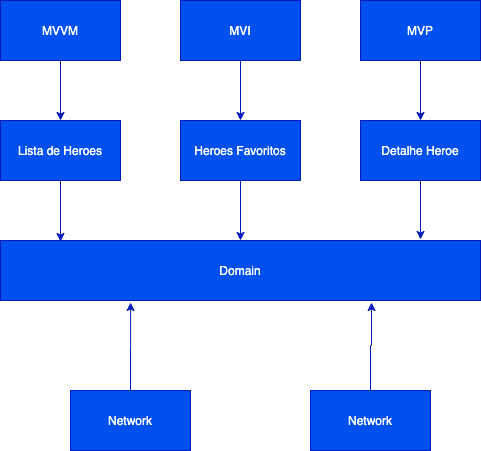

# Hero Marvel Project
[](https://circleci.com/gh/fioalpha/Hero-Marvel/tree/master)
[](https://ktlint.github.io/)
[](https://codeclimate.com/github/fioalpha/Hero-Marvel)
[](https://codecov.io/gh/fioalpha/Hero-Marvel)
[](https://www.codacy.com/manual/fioalpha/Hero-Marvel?utm_source=github.com&amp;utm_medium=referral&amp;utm_content=fioalpha/Hero-Marvel&amp;utm_campaign=Badge_Grade)


## Sobre
Esse projeto teste de conceito e a minha habilidade em desenvolvimento e teste de novos conceito de desenvolvimento.

## Overview do Projeto
Esse projeto consumer a api da [Marvel](https://developer.marvel.com/)
Temos tres telas
    - Tela de lista de heroes - Nessa tela é consume api da Marvel e mostra a lista de heroes, podendo adicionar nos favoritos e fazer pesquisa
    - Tela de Favoritos - Nessa tela mostra todos os heroes que foram adicionador como favorito e podemos remove-los
    - Tela de detalhe do Hero - Mostra algumas caracteristicas do hero




## Building and Running
É necessario criar o arquivo `local.properties` com as chaves `privata` e `publica` adquira no [Marvel](https://developer.marvel.com/)

api_public_key="CHAVE_PUBLICA"
api_private_key="CHAVE_PRIVADA"
`Obs.: Necessario adicionar as chaves entre aspas dupla`


Para um simples build

```bash
./emulate-ci-build.sh
```
Isso vai executar
 - Analise de códico estatico (Ktlin and Detekt)
 - Todos os teste unitários e gerar relatorio no JaCoCo report
 - Assemble o APK de debug

 Para roda o teste de interface
```
./gradlew connectedCheck
````
## License

```
The MIT License (MIT)

Copyright (c) 2019 Dotanuki Labs

Permission is hereby granted, free of charge, to any person obtaining a copy of
this software and associated documentation files (the "Software"), to deal in
the Software without restriction, including without limitation the rights to
use, copy, modify, merge, publish, distribute, sublicense, and/or sell copies of
the Software, and to permit persons to whom the Software is furnished to do so,
subject to the following conditions:

The above copyright notice and this permission notice shall be included in all
copies or substantial portions of the Software.

THE SOFTWARE IS PROVIDED "AS IS", WITHOUT WARRANTY OF ANY KIND, EXPRESS OR
IMPLIED, INCLUDING BUT NOT LIMITED TO THE WARRANTIES OF MERCHANTABILITY, FITNESS
FOR A PARTICULAR PURPOSE AND NONINFRINGEMENT. IN NO EVENT SHALL THE AUTHORS OR
COPYRIGHT HOLDERS BE LIABLE FOR ANY CLAIM, DAMAGES OR OTHER LIABILITY, WHETHER
IN AN ACTION OF CONTRACT, TORT OR OTHERWISE, ARISING FROM, OUT OF OR IN
CONNECTION WITH THE SOFTWARE OR THE USE OR OTHER DEALINGS IN THE SOFTWARE.


